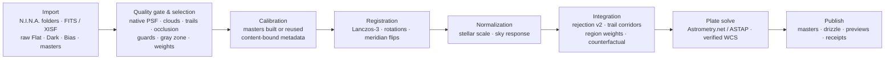

<p align="center">
  
</p>

<h1 align="center">Ultra-Fast WBPP</h1>

<p align="center"><b>Nights of astrophotography in. Verified, plate-solved masters out. In about a minute, not an evening.</b></p>

<p align="center">
  <a href="https://github.com/ShuoleiWang/Ultra-Fast-WBPP/actions/workflows/ci.yml"></a>
  
  
  
  <a href="LICENSE"></a>
</p>

<p align="center">
  <a href="docs/README.zh-CN.md">简体中文</a> ·
  <a href="#why-ultra-fast-wbpp">Why</a> ·
  <a href="#noteworthy-features">Features</a> ·
  <a href="#what-it-looks-like">Screenshots</a> ·
  <a href="#download">Download</a> ·
  <a href="#quick-start">Quick start</a> ·
  <a href="docs/README.md">Docs</a> ·
  <a href="CONTRIBUTING.md">Contributing</a>
</p>

<picture>
  <source media="(prefers-color-scheme: dark)" srcset="assets/branding/ultra-fast-wbpp-result-dark.png">
  
</picture>

<p align="center"><i>A native window, one project, one document. Light and dark follow the system. (Browser demo with labelled interface values; the native app shows your real frames and masters.)</i></p>

## Why Ultra-Fast WBPP

<table align="center">
  <tr>
    <th align="center">The same 61 Lights (26 MP, four nights, L R G B) on the same Mac</th>
  </tr>
  <tr>
    <td align="center">PixInsight WBPP 3.0.1 &nbsp;<b>24 min 11 s</b>&nbsp; → &nbsp;Ultra-Fast WBPP &nbsp;<b>76 s</b>&nbsp; from raw Lights to solved, verified masters</td>
  </tr>
</table>

- **Fast where it matters.** The hot loops are multithreaded native kernels that reproduce the NumPy reference bit for bit; a Light is decoded once, calibrated in memory and warped straight into the stack. A real-run tracer, not intuition, decided what to optimise: 170 s → 97 s → 82 s → 76 s over four releases, masters bit-identical at every step that promised it.
- **Selection a machine can defend.** Every Light is judged from measured evidence (transparency, extinction, native-resolution PSF, trailing, occlusion, field agreement) by the same code in the review page and in the run. The unattended policy, a recipe option, goes further: it re-checks every frame with a leave-one-out counterfactual measured *inside* the integration, so a frame stays only if the master is better with it, and partly clouded or partly blocked frames keep their clean area through per-frame region weight maps instead of being thrown away.
- **Nothing is published unverified.** Sources stay read-only, results go into a new directory, every product carries a receipt with hashes and the identifiers of everything that ran, and the desktop checks the final sky coordinates before it says "done". Two runs give the same bytes.
- **Measured against WBPP, not compared by eye.** [`benchmarks/evaluate_masters.py`](benchmarks/evaluate_masters.py) scores a master against the PixInsight WBPP master of the same data across PSF, noise gain, depth, background flatness, artefacts and photometry with confidence intervals. On the reference data set the luminance master is **EQUIVALENT** and the binned noise gain is 1.01–1.03 on all four filters ([standard](docs/master-evaluation-standard.md)).

### Compared with PixInsight WBPP

| | Ultra-Fast WBPP | PixInsight WBPP |
|---|---|---|
| 61 × 26 MP Lights, M3 Pro | **76 s** | 24 min 11 s (WBPP 3.0.1, its default route with LocalNormalization) |
| Frame selection | measured evidence → gate with stated reasons; the unattended policy adds a counterfactual check inside the integration and region weight maps for partial clouds and occlusion | whole-frame weights and threshold rejection |
| Trust | read-only sources, create-only results, receipts with hashes and algorithm ids, verified WCS before "done", bit-identical reruns | console log |
| Master quality | L EQUIVALENT, G₈ 1.01–1.03 vs WBPP's masters, PSF / background / photometry within tolerance | the reference |
| Drizzle | native 1×–4×, the ordinary master's exact photometric twin, Bayer drizzle | DrizzleIntegration |
| Platforms, license | macOS Apple Silicon, Windows x64 · MIT, no PixInsight needed | macOS, Windows, Linux · commercial |
| After preprocessing | linear masters, previews, receipts; no post-processing | a complete platform |

The WBPP time is one measurement of its default route on identical inputs; the tools' stage lists are not identical. The complete comparison with the evidence behind every row, and the list of what this project does *not* do, is [docs/features.md](docs/features.md). Mono is validated on real data; one-shot colour, mosaics and LocalNormalization on synthetic data only.

## Noteworthy features

- **Speed and determinism.** Native Lanczos-3 warp, rejection and reduction kernels value-identical to NumPy (17.6× / 4.5× / 5.4× faster); fused calibrate-and-warp; a deterministic Lanczos-3 weight table that builds the same on every platform; deterministic source extraction on Windows; a tolerance gate for the rare change that may move pixels. → [features §1–2](docs/features.md#1-speed-76-seconds-for-61--26-mp-lights), [benchmarks](benchmarks/README.md)
- **Unattended frame selection (recipe option).** Guards, gray zone, priorities (depth, balanced, resolution), native-resolution PSF stamps, confidence-scaled weights, a counterfactual oracle with up to three re-integration passes, region weight maps. Validated with defect injection on real frames: every defect handled, zero false positives on clean and benign frames. → [features §3](docs/features.md#3-frame-selection-a-machine-can-defend), [architecture](docs/architecture.md#unattended-light-selection)
- **Integration science.** Projective registration across nights and meridian flips; rejection scale model v2 that judges every frame against its own noise; satellite trails found from their whole length with a fast Radon transform and removed as corridors; normalization that separates residual flat-field structure in the sensor frame; one shared grid for all channels with mutually verified solutions. → [features §4](docs/features.md#4-integration-science)
- **Drizzle and colour.** Native 1×–4× drizzle from exactly the ordinary integration's inputs (2×: half-light radius 2.5–4.4 % smaller, effective noise 6–7 % lower, flux ratio 0.993–0.994); Bayer Lights as colour channel groups with per-channel flat scaling and Bayer drizzle. → [drizzle](docs/recipes/drizzle.md), [OSC](docs/recipes/osc-cfa.md)
- **Verified publication.** `SEED` versus `SOLVED` WCS; every master solved independently and verified against catalog stars (on Windows, ASTAP verified against the managed index stars); receipts for every product; the desktop re-verifies before success. → [astrometry](docs/recipes/astrometry.md), [Windows](docs/windows.md)
- **A desktop that stays out of the way.** Import every night at once, screening folded into the run, an optional review page, honest failure states, light and dark, English and Chinese, a reproducible icon and screenshots. → [desktop guide](apps/desktop/README.md), [design record](docs/gui-redesign-plan.md)
- **Two platforms, one platform layer.** Validated on an M3 Pro and on a Ryzen 7 5800H Windows laptop (267–289 s for the same project); static-CRT Windows bundles attested down to every DLL import. → [hardware](docs/hardware.md), [Windows](docs/windows.md)
- **Tools for contributors.** Real-run tracer (Perfetto), master evaluator, tolerance gate, defect-injection harness, native-vs-NumPy benchmarks, one build-test-install chain for the kernels, bundle attestation, public-tree and link checks. → [features §10](docs/features.md#10-tools-contributors-actually-get)

## What it looks like

| Import | Screening |
|---|---|
| <picture><source media="(prefers-color-scheme: dark)" srcset="assets/branding/ultra-fast-wbpp-frames-dark.png"></picture> | <picture><source media="(prefers-color-scheme: dark)" srcset="assets/branding/ultra-fast-wbpp-review-dark.png"></picture> |
| **Processing** | **Result** |
| <picture><source media="(prefers-color-scheme: dark)" srcset="assets/branding/ultra-fast-wbpp-run-dark.png"></picture> | <picture><source media="(prefers-color-scheme: dark)" srcset="assets/branding/ultra-fast-wbpp-result-dark.png"></picture> |

Screenshots are rendered from the app's labelled browser demo by [`apps/desktop/scripts/screenshots.py`](apps/desktop/scripts/screenshots.py); the numbers in them are interface placeholders, not measurements.

## How it works



1. **Import together.** Drop every night at once: Lights, raw calibration frames and existing masters. Types, targets, filters and acquisition profiles come from the headers; conflicts are shown, never guessed. Bayer Lights are recognised and processed as colour channel groups.
2. **Screen automatically.** The quality gate measures each Light and admits it, holds it for review or excludes it, with the reasons and previews in the result. Review before the run if you want to; the launch bar tells you beforehand what the run will leave out. With `selection.policy: unattended-v1` in the recipe the same evidence becomes *keep*, *keep with reduced weight* or *exclude* without a review gate, checked by the counterfactual and written to `qc/selection.json`.
3. **Process locally.** Calibration, registration, normalization, integration with robust rejection, optional drizzle and LocalNormalization, and a per-channel astrometric solve run as one job with live progress on every core you have.
4. **Get verified products.** Linear mono and RGB/LRGB FITS, drizzle science/weight/coverage products, inspection previews, the screening report and receipts. The app shows *done* only after the receipt, the product hashes and the final WCS have been verified.

## Download

Prebuilt installers are attached to every release on the [Releases page](https://github.com/ShuoleiWang/Ultra-Fast-WBPP/releases), together with `SHA256SUMS-<target>` files and the bundle attestations produced in the same workflow run. They are unsigned alpha builds; check the checksum before installing.

- **Windows 10 / 11 x64.** `Ultra-Fast-WBPP_<version>_x64-setup.exe` installs per user under `%LOCALAPPDATA%` without administrator rights (the usual choice); `Ultra-Fast-WBPP_<version>_x64_en-US.msi` installs per machine into Program Files. Without an Authenticode signature SmartScreen shows "Windows protected your PC → More info → Run anyway" for the setup and an unknown-publisher prompt for the MSI. WebView2 is installed silently when missing; no Visual C++ redistributable is needed ([Windows](docs/windows.md)).
- **macOS (Apple Silicon).** `Ultra-Fast-WBPP_<version>_aarch64.dmg`, ad-hoc signed and not notarized: open the app once via right-click → Open, or System Settings → Privacy & Security → Open Anyway.
- **Then set up a plate solver** (nothing is bundled): ASTAP with a star database on Windows, Astrometry.net `solve-field` on macOS, plus the app-managed index set from the solver panel (about 350 MB); press **Recheck setup** in the app. See [Status and requirements](#status-and-requirements).

## Quick start

To build from source instead of installing a release you need Python 3.11+, Rust 1.88+, Node.js 22+, CMake 3.28+ and the [Tauri prerequisites](https://v2.tauri.app/start/prerequisites/) (Xcode on macOS 14+ with Apple Silicon; Visual Studio 2022 Build Tools on Windows, installed by [`scripts/windows/bootstrap.ps1`](scripts/windows/README.md)).

```bash
make bootstrap
```

```bash
make desktop-dev
```

Import your folders, choose an output folder (remembered next time) and press **Start processing**. To try the interface without data, `make demo` opens the labelled browser demo. On Windows create the environment with `py -3.12 -m venv .venv` and use `.venv\Scripts\python.exe` for the Makefile's Python commands ([Windows notes](docs/windows.md)).

The same engine runs from the command line, with the selection policy chosen in the recipe:

```bash
.venv/bin/ultra-fast-wbpp run /data/lights /data/calibration --recipe docs/recipes/mono-standard.json --output /data/new-result --progress-json
```

```json
{ "selection": { "policy": "unattended-v1", "priority": "balanced" } }
```

`ultra-fast-wbpp doctor --json` reports the hardware, the native kernels and the solver readiness; `run-project` is the multi-target, multi-filter route the desktop uses. A local `.app` with the Python runtime bundled: `make desktop-build-macos-prerelease` ([release packaging](docs/release-process.md)).

## Status and requirements

- **Alpha, under active development.** Real-data runs are validated on one M3 Pro (macOS) and one Ryzen 7 5800H laptop (Windows 11); other machines run generic, unmeasured profiles. Local builds are ad-hoc signed, not notarized; the Windows installer is unsigned. The register of what is and is not validated is [docs/validation-matrix.md](docs/validation-matrix.md).
- **Mono validated on real data; one-shot colour on synthetic data only.** Bayer (RGGB/BGGR/GRBG/GBRG) Lights are calibrated as mosaics, debayered into R/G/B channel masters and combined into RGB ([recipe](docs/recipes/osc-cfa.md)), but no real OSC data set has been processed yet. Mosaics and LocalNormalization need real-data validation; LocalNormalization does not promise gradient-free output.
- **Selection.** The desktop runs the legacy gate today (PASS frames are stacked, REVIEW frames are excluded unless approved). The unattended policy with the counterfactual and region weights is a recipe option for the command line; its default stays `legacy-gate` until more data sets have been run.
- **Plate solving** needs a separately installed solver: Astrometry.net `solve-field` with local indexes on macOS ([solver setup](docs/recipes/offline-solver-catalogs.md)), ASTAP with a star database plus the app-managed index set on Windows ([Windows](docs/windows.md)); then **Recheck setup** in the app. Nothing is uploaded anywhere.
- Disk space for full-resolution intermediate frames (about 12 bytes per pixel per Light on the output volume).

## Numbers

| What | Result | Where |
|---|---|---|
| 61 Lights · 4 nights · L R G B · M3 Pro | **76 s** end to end (170 s four releases ago) | [CHANGELOG](CHANGELOG.md), [hardware](docs/hardware.md) |
| PixInsight WBPP 3.0.1, same Lights, same Mac | 24 min 11 s | [features §1](docs/features.md#1-speed-76-seconds-for-61--26-mp-lights) |
| Same project on a Ryzen 7 5800H laptop, Windows 11 | 267–289 s | [Windows](docs/windows.md) |
| Two runs of one project on the same machine (verified on macOS and Windows) | bit-identical | [validation matrix](docs/validation-matrix.md) |
| Luminance master vs PixInsight WBPP | EQUIVALENT (G₈ ≈ 1.01–1.02); G₈ 1.01–1.03 on all four filters | [evaluation standard](docs/master-evaluation-standard.md), [features §5](docs/features.md#5-master-quality-against-pixinsight-wbpp) |
| 2× drizzle vs the Lanczos-3 master | half-light radius 2.5–4.4 % smaller, effective noise 6–7 % lower, flux ratio 0.993–0.994 | [drizzle recipe](docs/recipes/drizzle.md) |
| Native kernels vs the NumPy reference | warp 17.6×, integration 4.5×, pipeline 5.4×, pixels identical | [benchmarks](benchmarks/README.md) |
| Synthetic defects on real frames (thin/patchy cloud, dew, defocus, occlusion, trailing) | every defect handled, no clean or benign frame penalised | [selection record](docs/frame-selection-implementation.md) |

This independent implementation does not claim algorithmic or pixel equivalence to PixInsight/WBPP; the evaluation standard is how it is compared.

## Repository

| Directory | Responsibility |
|---|---|
| `apps/desktop` | React interface and Tauri desktop bridge ([guide](apps/desktop/README.md)) |
| `crates/app-core` | Project state and execution contracts shared by GUI and workers |
| `packages/openastroflow-engine` | Calibration, registration, normalization, integration, drizzle, selection, solvers, CLI |
| `packages/light-frame-qc` | Light measurements, native PSF, quality gate |
| `engine/native` | C++ kernels (warp, rejection, reduction, drizzle, debayer, Lanczos table) and Metal |
| `benchmarks` | Master evaluation, tolerance gate, run tracer, kernel benchmarks, selection harnesses |
| `scripts`, `packaging` | Native build chain, sidecar packaging, bundle attestation, public-tree and link checks |
| `docs` | [Index](docs/README.md) · [features](docs/features.md) · [architecture](docs/architecture.md) · [recipes](docs/recipes/README.md) · [validation](docs/validation-matrix.md) · [Windows](docs/windows.md) |

Contributing: [CONTRIBUTING.md](CONTRIBUTING.md) for setup and rules, [AGENTS.md](AGENTS.md) for the full working guide (read automatically by Codex), [CLAUDE.md](CLAUDE.md) for Claude Code sessions. `make test` runs the Python, Rust, frontend and native tests; `make check` adds formatting, lint and the public-tree checks.

## License

Original code is [MIT licensed](LICENSE); keep the copyright and license notice when redistributing, including commercially ([NOTICE](NOTICE) suggests an attribution). Third-party components keep their own licenses ([licensing](docs/licensing.md), [third-party notices](THIRD_PARTY_NOTICES.md)); the Python runtime imports no GPL-licensed library.

Not affiliated with PixInsight, Pleiades Astrophoto, N.I.N.A., Astrometry.net or ASTAP; contains no PixInsight/PCL source or binaries.
