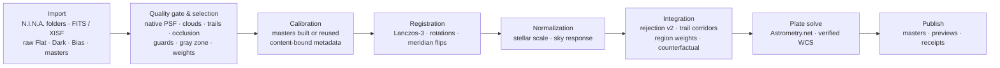

<p align="center">
  
</p>

<h1 align="center">Ultra-Fast WBPP</h1>

<p align="center"><b>Nights of monochrome astrophotography in. Verified, plate-solved masters out. Minutes, not hours.</b></p>

<p align="center">
  <a href="https://github.com/ShuoleiWang/Ultra-Fast-WBPP/actions/workflows/ci.yml"></a>
  
  
  <a href="LICENSE"></a>
</p>

<p align="center">
  <a href="docs/README.zh-CN.md">简体中文</a> ·
  <a href="#what-it-looks-like">Screenshots</a> ·
  <a href="#quick-start">Quick start</a> ·
  <a href="#how-it-works">How it works</a> ·
  <a href="docs/architecture.md">Architecture</a> ·
  <a href="docs/validation-matrix.md">Validation</a> ·
  <a href="CONTRIBUTING.md">Contributing</a>
</p>

<picture>
  <source media="(prefers-color-scheme: dark)" srcset="assets/branding/ultra-fast-wbpp-result-dark.png">
  
</picture>

<p align="center"><i>The desktop app is a native macOS window: one project, one document. Light and dark follow the system. (Browser demo with labelled interface values; the native app shows your real frames and masters.)</i></p>

## Why

- **Fast where it matters.** A 61-frame, four-night, four-filter project runs from raw Lights to solved masters in **97 s on an M3 Pro** (it was 170 s a release ago), with the masters bit-identical across runs and machines. Hot loops are native CPU kernels; nothing is decoded twice.
- **Selection a machine can defend.** Every Light is judged from measured evidence (transparency, extinction, native-resolution PSF, trailing, occlusion, field agreement) and then re-checked by a leave-one-out counterfactual measured *inside* the integration: a frame stays only if the master is better with it. Partly clouded or partly blocked frames keep their clean area through per-frame region weight maps instead of being thrown away.
- **Nothing is published unverified.** Sources stay read-only, results go into a new directory, every product carries a receipt with hashes, and the desktop checks the final sky coordinates before it says "done".
- **Measured, not claimed.** [`benchmarks/evaluate_masters.py`](benchmarks/evaluate_masters.py) scores a master against the PixInsight WBPP master of the same data (PSF, noise gain, depth, background flatness, artefacts, photometry). On the reference dataset the luminance master evaluates as **EQUIVALENT** with a small SNR gain. See the [master evaluation standard](docs/master-evaluation-standard.md).
- **Feels like a Mac app.** Toolbar, source-list sidebar, inspector, hairlines and system controls; SF typography; an application icon and brand mark rendered from [one reproducible script](apps/desktop/scripts/brand_icon.py).

## What it looks like

| Import | Screening |
|---|---|
| <picture><source media="(prefers-color-scheme: dark)" srcset="assets/branding/ultra-fast-wbpp-frames-dark.png"></picture> | <picture><source media="(prefers-color-scheme: dark)" srcset="assets/branding/ultra-fast-wbpp-review-dark.png"></picture> |
| **Processing** | **Result** |
| <picture><source media="(prefers-color-scheme: dark)" srcset="assets/branding/ultra-fast-wbpp-run-dark.png"></picture> | <picture><source media="(prefers-color-scheme: dark)" srcset="assets/branding/ultra-fast-wbpp-result-dark.png"></picture> |

Screenshots are rendered from the app's labelled browser demo by [`apps/desktop/scripts/screenshots.py`](apps/desktop/scripts/screenshots.py); the numbers in them are interface placeholders, not measurements.

## How it works



1. **Import together.** Drop every night at once: Lights, raw calibration frames and existing masters. Types, targets, filters and acquisition profiles come from the headers; conflicts are shown, never guessed.
2. **Screen automatically.** The quality gate measures each Light; the selection policy turns the evidence into *keep*, *keep with reduced weight* or *exclude* and writes the reasons and the counterfactual numbers to `qc/selection.json`. You can review before the run, or just start.
3. **Process locally.** Calibration, registration, normalization, integration with robust rejection, optional Drizzle and LocalNormalization, and a per-channel astrometric solve run as one job with live progress.
4. **Get verified products.** Linear mono and RGB/LRGB FITS, inspection previews, the screening report and receipts. The app shows *done* only after the receipt, the product hashes and the final WCS have been verified.

## Quick start

Alpha: there is no public installer yet. Build from source on macOS 14+ (Apple Silicon) with Python 3.11+, Rust 1.88+, Node.js 22+, CMake 3.28+ and the [Tauri prerequisites](https://v2.tauri.app/start/prerequisites/) including Xcode:

```bash
make bootstrap
```

```bash
make desktop-dev
```

Import your folders, choose an output folder (remembered next time) and press **Start processing**. To try the interface without data, `make demo` opens the labelled browser demo.

The same engine runs from the command line, with the selection policy chosen in the recipe:

```bash
.venv/bin/ultra-fast-wbpp run /data/lights /data/calibration --recipe docs/recipes/mono-standard.json --output /data/new-result --progress-json
```

```json
{ "selection": { "policy": "unattended-v1", "priority": "balanced" } }
```

A local `.app` with the Python runtime bundled: `make desktop-build-macos-prerelease` (see [release packaging](docs/release-process.md)).

## Status and requirements

- **Alpha, under active development.** Target: Apple Silicon, macOS 14+. Real-data runs are checked on an M3 Pro; other Macs need acceptance testing. Local builds are ad-hoc signed, not notarized. Windows x64 (Windows 10 22H2 / 11) is supported with ASTAP as the verified plate solver; see [docs/windows.md](docs/windows.md) for what is validated and the unsigned-installer caveats.
- **Mono validated on real data; one-shot colour on synthetic data only.** Bayer (RGGB/BGGR/GRBG/GBRG) Lights are calibrated as mosaics, debayered into R/G/B channel masters and combined into RGB ([recipe](docs/recipes/osc-cfa.md)), but no real OSC data set has been processed yet. Drizzle, LocalNormalization, RGB/LRGB and mosaics need broader real-data validation; LocalNormalization does not promise gradient-free output.
- **Plate solving** needs a separately installed Astrometry.net `solve-field` and local indexes: follow [solver setup](docs/recipes/offline-solver-catalogs.md), then **Recheck setup** in the app.
- Disk space for full-resolution intermediate frames.

## Numbers

| What | Result | Where |
|---|---|---|
| 61 Lights · 4 nights · L R G B · M3 Pro | 97 s end to end (was 170 s) | [CHANGELOG](CHANGELOG.md), [hardware notes](docs/hardware.md) |
| Masters across runs and machines | bit-identical | [validation matrix](docs/validation-matrix.md) |
| Luminance master vs PixInsight WBPP | EQUIVALENT (G₈ ≈ 1.01, FWHM 0.4 % better) | [master evaluation standard](docs/master-evaluation-standard.md) |
| Synthetic defects on real frames (thin/patchy cloud, dew, defocus, occlusion, trailing) | every defect handled, no clean or benign frame penalised | [frame selection results](docs/frame-selection-implementation.md) |

This independent implementation does not claim algorithmic or pixel equivalence to PixInsight/WBPP; the evaluation standard is how it is compared.

## Repository

| Directory | Responsibility |
|---|---|
| `apps/desktop` | React interface and Tauri desktop bridge ([guide](apps/desktop/README.md), [GUI design](docs/gui-redesign-plan.md)) |
| `crates/app-core` | Project state and execution contracts |
| `packages/openastroflow-engine` | Calibration, registration, integration, selection, CLI |
| `packages/light-frame-qc` | Light measurements, native PSF, quality decisions |
| `engine/native` | C++ kernels (registration warp, rejection, reduction, Radon) and Metal |
| `benchmarks` | Master evaluation, selection oracle and defect-injection harnesses |
| `docs` | [Architecture](docs/architecture.md), [selection plan](docs/frame-selection-plan.md), [recipes](docs/recipes), [validation](docs/validation-matrix.md), [Windows](docs/windows.md) |

`make test` runs the Python, Rust, frontend and native tests; `make check` adds formatting and lint.

## License

Original code is [MIT licensed](LICENSE); keep the copyright and license notice when redistributing, including commercially ([NOTICE](NOTICE) suggests an attribution). Third-party components keep their own licenses ([licensing](docs/licensing.md), [third-party notices](THIRD_PARTY_NOTICES.md)); the Python runtime imports no GPL-licensed library.

Not affiliated with PixInsight, Pleiades Astrophoto, N.I.N.A. or Astrometry.net; contains no PixInsight/PCL source or binaries.
