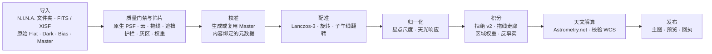

<p align="center">
  
</p>

<h1 align="center">Ultra-Fast WBPP</h1>

<p align="center"><b>多晚的单色天文素材进去，经过校验、已解算的主图出来。几分钟，不是几小时。</b></p>

<p align="center">
  <a href="https://github.com/ShuoleiWang/Ultra-Fast-WBPP/actions/workflows/ci.yml"></a>
  
  
  <a href="../LICENSE"></a>
</p>

<p align="center">
  <a href="../README.md">English</a> ·
  <a href="#界面">界面</a> ·
  <a href="#快速开始">快速开始</a> ·
  <a href="#工作原理">工作原理</a> ·
  <a href="architecture.md">架构</a> ·
  <a href="validation-matrix.md">验证记录</a> ·
  <a href="../CONTRIBUTING.md">参与贡献</a>
</p>

<picture>
  <source media="(prefers-color-scheme: dark)" srcset="../assets/branding/ultra-fast-wbpp-result-dark.png">
  
</picture>

<p align="center"><i>原生 macOS 窗口：一个项目就是一份文档。浅色/深色随系统。（截图来自带标注的浏览器演示；原生应用显示的是你的真实帧与主图。）</i></p>

## 为什么用它

- **快在关键处。** 61 帧、四晚、四滤镜的项目，从原始 Light 到已解算主图 **M3 Pro 上 97 秒**（上一版本 170 秒），且主图在不同运行、不同机器上逐位一致。热点循环是原生 CPU 内核，没有任何一帧被解码两次。
- **机器能为自己辩护的筛片。** 每张 Light 先由测量证据判定（透明度、消光、原生分辨率 PSF、拖线、遮挡、视场一致性），再由积分过程中*就地*测量的留一反事实复核：只有主图因它而更好，它才留下。局部有云或局部遮挡的帧通过逐帧区域权重图保留清晰部分，而不是整帧丢弃。
- **未经校验绝不发布。** 原始素材只读，结果只写入新目录，每个产品都带有含哈希的回执；桌面端校验最终天球坐标后才显示"完成"。
- **用数据说话。** [`benchmarks/evaluate_masters.py`](../benchmarks/evaluate_masters.py) 把主图与同一批数据的 PixInsight WBPP 主图逐项对比（PSF、噪声增益、深度、背景平坦度、伪影、测光）。在参考数据集上，亮度主图判定为 **EQUIVALENT** 并略有信噪比增益。见[主图评估标准](master-evaluation-standard.md)。
- **像一个 Mac 应用。** 工具栏、Source List 侧栏、检视器、hairline 分隔与系统控件；SF 字体；应用图标与品牌标志由[一个可复现的脚本](../apps/desktop/scripts/brand_icon.py)生成。

## 界面

| 导入 | 筛片 |
|---|---|
| <picture><source media="(prefers-color-scheme: dark)" srcset="../assets/branding/ultra-fast-wbpp-frames-dark.png"></picture> | <picture><source media="(prefers-color-scheme: dark)" srcset="../assets/branding/ultra-fast-wbpp-review-dark.png"></picture> |
| **处理** | **结果** |
| <picture><source media="(prefers-color-scheme: dark)" srcset="../assets/branding/ultra-fast-wbpp-run-dark.png"></picture> | <picture><source media="(prefers-color-scheme: dark)" srcset="../assets/branding/ultra-fast-wbpp-result-dark.png"></picture> |

截图由 [`apps/desktop/scripts/screenshots.py`](../apps/desktop/scripts/screenshots.py) 从应用自带的带标注浏览器演示渲染；其中的数字是界面占位值，不是测量结果。

## 工作原理



1. **一起导入。** 把所有夜晚一次拖入：Light、原始校准帧和已有 Master。类型、目标、滤镜和采集配置来自头信息；冲突会被显示，绝不猜测。
2. **自动筛片。** 质量门禁测量每张 Light；筛片策略把证据变成*保留*、*降权保留*或*排除*，并把理由和反事实数字写入 `qc/selection.json`。可以先看再跑，也可以直接开始。
3. **本地处理。** 校准、配准、归一化、稳健拒绝的积分、可选的 Drizzle 与 LocalNormalization，以及逐通道天文解算，作为一个任务带实时进度运行。
4. **得到已校验的产品。** 线性单色与 RGB/LRGB FITS、检查预览、筛片报告与回执。只有回执、产品哈希与最终 WCS 全部校验通过，应用才显示*完成*。

## 快速开始

Alpha 阶段，暂无公开安装包。在 macOS 14+（Apple Silicon）上准备 Python 3.11+、Rust 1.88+、Node.js 22+、CMake 3.28+ 以及包括 Xcode 在内的 [Tauri 开发环境](https://v2.tauri.app/start/prerequisites/)，然后从源码构建：

```bash
make bootstrap
```

```bash
make desktop-dev
```

拖入文件夹，选择输出文件夹（下次会记住），按下**开始处理**。想先看看界面，`make demo` 会打开带标注的浏览器演示。

同一个引擎也能在命令行运行，筛片策略在配方里选择：

```bash
.venv/bin/ultra-fast-wbpp run /data/lights /data/calibration --recipe docs/recipes/mono-standard.json --output /data/new-result --progress-json
```

```json
{ "selection": { "policy": "unattended-v1", "priority": "balanced" } }
```

打包含 Python 运行时的本地 `.app`：`make desktop-build-macos-prerelease`（见[发布流程](release-process.md)）。

## 状态与要求

- **积极开发中的 alpha。** 目标平台 Apple Silicon、macOS 14+。真实素材流程在 M3 Pro 上验证；其他 Mac 仍待验收。本地构建为 ad-hoc 签名，未公证。Windows 有构建与测试目标，暂无受支持的安装包。
- **仅单色。** 不处理 OSC/Bayer 数据。Drizzle、LocalNormalization、RGB/LRGB 与马赛克需要更广泛的真实数据验证；LocalNormalization 不保证无梯度输出。
- **天文解算**需要另行安装 Astrometry.net 的 `solve-field` 与本地索引：按[求解器设置](recipes/offline-solver-catalogs.md)配置，然后在应用中**重新检测配置**。
- 需要保存全分辨率中间帧的磁盘空间。

## 数字

| 项目 | 结果 | 出处 |
|---|---|---|
| 61 张 Light · 4 晚 · L R G B · M3 Pro | 端到端 97 秒（原 170 秒） | [CHANGELOG](../CHANGELOG.md)、[硬件说明](hardware.md) |
| 不同运行与机器之间的主图 | 逐位一致 | [验证矩阵](validation-matrix.md) |
| 亮度主图 vs PixInsight WBPP | EQUIVALENT（G₈ ≈ 1.01，FWHM 好 0.4%） | [主图评估标准](master-evaluation-standard.md) |
| 真实帧上注入的合成缺陷（薄云、局部云、结露、失焦、遮挡、拖线） | 每种缺陷都被处理，干净帧与良性对照无一被误伤 | [筛片实现记录](frame-selection-implementation.md) |

本项目是独立实现，不声称与 PixInsight/WBPP 在算法或像素上等价；评估标准就是它被比较的方式。

## 仓库结构

| 目录 | 职责 |
|---|---|
| `apps/desktop` | React 界面与 Tauri 桌面桥接（[开发指南](../apps/desktop/README.md)、[GUI 设计](gui-redesign-plan.md)） |
| `crates/app-core` | 项目状态与执行契约 |
| `packages/openastroflow-engine` | 校准、配准、积分、筛片、命令行 |
| `packages/light-frame-qc` | Light 测量、原生 PSF、质量判定 |
| `engine/native` | C++ 内核（配准重采样、拒绝、归约、Radon）与 Metal |
| `benchmarks` | 主图评估、筛片 oracle 与缺陷注入 harness |
| `docs` | [架构](architecture.md)、[筛片方案](frame-selection-plan.md)、[配方](recipes)、[验证](validation-matrix.md)、[Windows](windows.md) |

`make test` 运行 Python、Rust、前端与原生测试；`make check` 另加格式与 lint 检查。

## 许可

原创代码采用 [MIT 许可](../LICENSE)；再分发（包括商业再分发）须保留版权与许可声明（[NOTICE](../NOTICE) 给出建议的署名）。第三方组件保留各自许可（[许可说明](licensing.md)、[第三方声明](../THIRD_PARTY_NOTICES.md)）；Python 运行时不引入任何 GPL 许可的库。

与 PixInsight、Pleiades Astrophoto、N.I.N.A. 或 Astrometry.net 无关，不含 PixInsight/PCL 源码或二进制。
