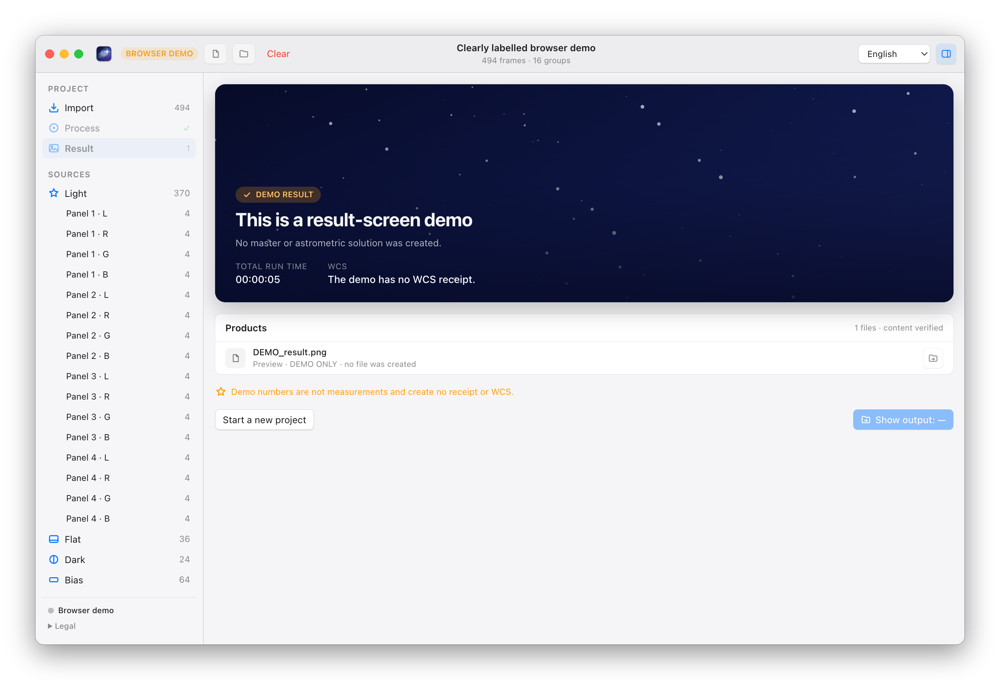
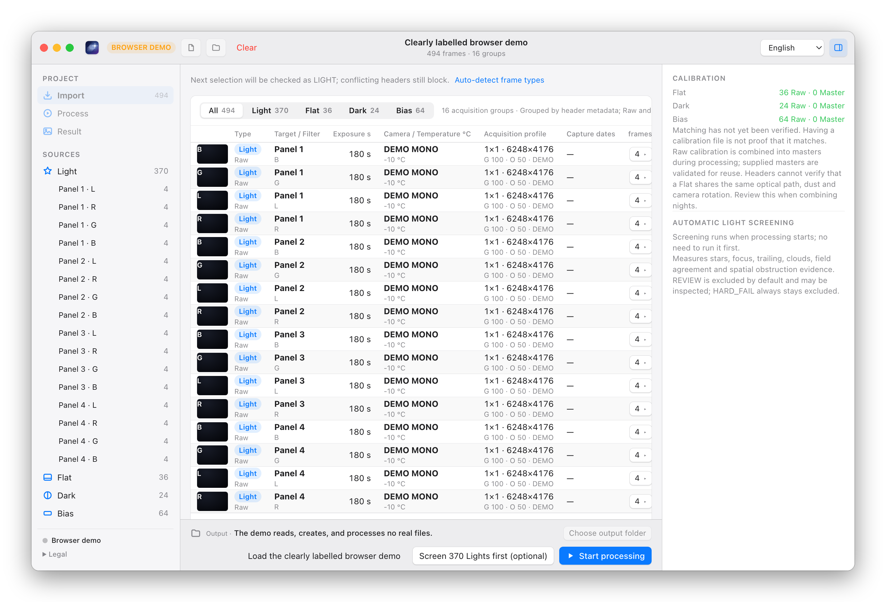
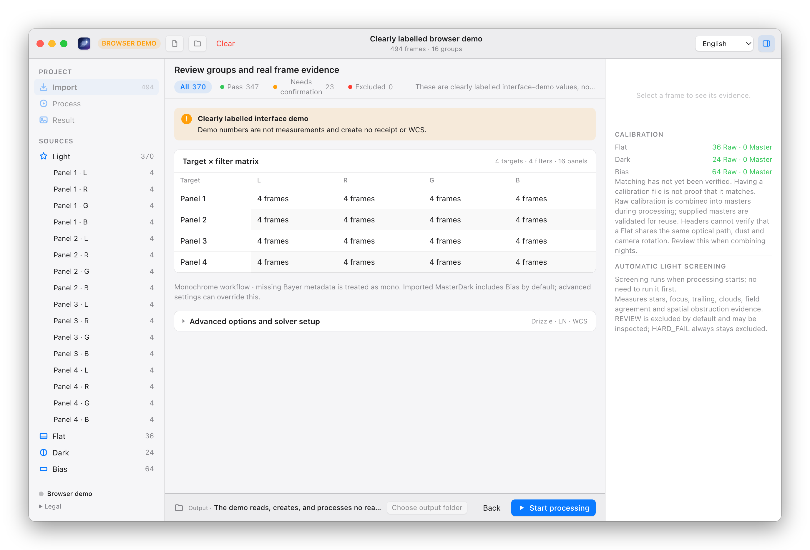
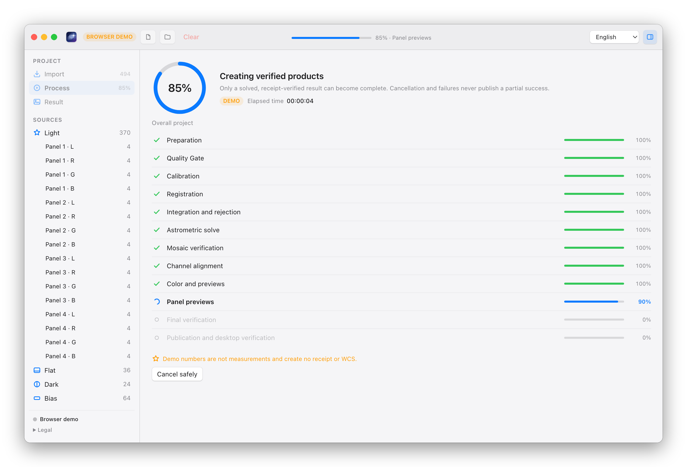
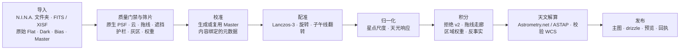

<p align="center">
  
</p>

<h1 align="center">Ultra-Fast WBPP</h1>

<p align="center"><b>多晚的天文素材进去，经过校验、已解算的主图出来。一分钟左右，不是一整晚。</b></p>

<p align="center">
  <a href="https://github.com/ShuoleiWang/Ultra-Fast-WBPP/actions/workflows/ci.yml"></a>
  
  
  
  <a href="../LICENSE"></a>
</p>

<p align="center">
  <a href="../README.md">English</a> ·
  <a href="#为什么用-ultra-fast-wbpp">为什么</a> ·
  <a href="#值得一提的功能">功能</a> ·
  <a href="#界面">界面</a> ·
  <a href="#下载">下载</a> ·
  <a href="#快速开始">快速开始</a> ·
  <a href="README.md">文档索引</a> ·
  <a href="../CONTRIBUTING.md">参与贡献</a>
</p>

<picture>
  <source media="(prefers-color-scheme: dark)" srcset="../assets/branding/ultra-fast-wbpp-result-dark.png">
  
</picture>

<p align="center"><i>原生窗口：一个项目就是一份文档。浅色/深色随系统。（截图来自带标注的浏览器演示；原生应用显示的是你的真实帧与主图。）</i></p>

## 为什么用 Ultra-Fast WBPP

<table align="center">
  <tr>
    <th align="center">同一批 61 张 Light（26 MP，四晚，L R G B），同一台 Mac</th>
  </tr>
  <tr>
    <td align="center">PixInsight WBPP 3.0.1 &nbsp;<b>24 分 11 秒</b>&nbsp; → &nbsp;Ultra-Fast WBPP &nbsp;<b>76 秒</b>&nbsp;（从原始 Light 到已解算、已校验的主图）</td>
  </tr>
</table>

- **快在关键处。** 热点循环是多线程原生内核，与 NumPy 参考实现逐位一致；每张 Light 只解码一次，在内存里完成校准并直接重采样进堆栈。优化目标由真实运行的追踪器决定，而不是凭感觉：四个版本里从 170 秒 → 97 秒 → 82 秒 → 76 秒，凡承诺逐位一致的步骤主图都逐位一致。
- **机器能为自己辩护的筛片。** 每张 Light 由测量证据判定（透明度、消光、原生分辨率 PSF、拖线、遮挡、视场一致性），复核页与正式运行用的是同一份代码。无人值守策略（配方选项）更进一步：用积分过程中*就地*测量的留一反事实复核每一帧，只有主图因它而更好，它才留下；局部有云或局部遮挡的帧通过逐帧区域权重图保留清晰部分，而不是整帧丢弃。
- **未经校验绝不发布。** 原始素材只读，结果只写入新目录，每个产品都带有含哈希与全部算法标识的回执；桌面端校验最终天球坐标后才显示"完成"。跑两次得到相同的字节。
- **用标准对比 WBPP，而不是用眼睛。** [`benchmarks/evaluate_masters.py`](../benchmarks/evaluate_masters.py) 把主图与同一批数据的 PixInsight WBPP 主图在 PSF、噪声增益、深度、背景平坦度、伪影、测光上逐项打分并给出置信区间。在参考数据集上，亮度主图判定为 **EQUIVALENT**，四个滤镜的分箱噪声增益均为 1.01–1.03（[评估标准](master-evaluation-standard.md)）。

### 与 PixInsight WBPP 对比

| | Ultra-Fast WBPP | PixInsight WBPP |
|---|---|---|
| 61 × 26 MP Light，M3 Pro | **76 秒** | 24 分 11 秒（WBPP 3.0.1，默认流程，含 LocalNormalization） |
| 筛片 | 测量证据 → 带理由的门禁判定；无人值守策略再加积分内反事实复核，局部云、遮挡用区域权重图 | 整帧加权与阈值剔除 |
| 可信度 | 素材只读、结果只新建、含哈希与算法标识的回执、"完成"前校验 WCS、重跑逐位一致 | 控制台日志 |
| 主图质量 | 对 WBPP 主图：L EQUIVALENT，G₈ 1.01–1.03，PSF / 背景 / 测光均在容差内 | 参考基准 |
| Drizzle | 原生 1×–4×，是普通主图的精确测光孪生；支持 Bayer drizzle | DrizzleIntegration |
| 平台与许可 | macOS Apple Silicon、Windows x64 · MIT，不需要 PixInsight | macOS、Windows、Linux · 商业授权 |
| 预处理之后 | 线性主图、预览、回执；不做后期 | 完整的处理平台 |

WBPP 的耗时是对相同输入、其默认流程的一次测量；两者的阶段并不完全相同。完整的对比、每一行背后的证据以及本项目*不做*什么，见 [docs/features.md](features.md)（英文）。单色已在真实数据上验证；彩色相机、马赛克与 LocalNormalization 目前仅有合成数据验证。

## 值得一提的功能

- **速度与确定性。** 原生 Lanczos-3 重采样、拒绝与归约内核与 NumPy 逐值一致（分别快 17.6× / 4.5× / 5.4×）；校准与重采样融合为一遍；在任何平台都构建出相同结果的确定性 Lanczos-3 权重表；Windows 上确定性的星点提取；对极少数允许移动像素的改动有容差门。→ [features §1–2](features.md#1-speed-76-seconds-for-61--26-mp-lights)、[benchmarks](../benchmarks/README.md)
- **无人值守筛片（配方选项）。** 护栏、灰区、优先级（深度 / 平衡 / 分辨率）、原生分辨率 PSF 星点小图、按置信度缩放的权重、最多三轮重积分的反事实 oracle、区域权重图。用真实帧上的缺陷注入验证：每种缺陷都被处理，干净帧与良性对照零误伤。→ [features §3](features.md#3-frame-selection-a-machine-can-defend)、[架构](architecture.md#unattended-light-selection)
- **积分科学。** 跨夜、跨子午线翻转的射影配准；按每帧自身噪声判定的拒绝尺度模型 v2；用快速 Radon 变换按整条长度找出卫星拖线并按走廊剔除；在传感器坐标系分离残余平场结构的归一化；所有通道共用一个网格并互相校验解算结果。→ [features §4](features.md#4-integration-science)
- **Drizzle 与彩色。** 原生 1×–4× drizzle，输入与普通积分完全相同（2×：半光半径小 2.5–4.4%，有效噪声低 6–7%，通量比 0.993–0.994）；Bayer Light 作为彩色通道组处理，逐通道平场缩放，Bayer drizzle。→ [drizzle](recipes/drizzle.md)、[OSC](recipes/osc-cfa.md)
- **校验后发布。** `SEED` 与 `SOLVED` WCS 的区分；每张主图独立解算并对星表校验（Windows 上 ASTAP 的解由引擎对管理索引星表校验）；每个产品都有回执；桌面端在显示成功前再校验一次。→ [天文解算](recipes/astrometry.md)、[Windows](windows.md)
- **不碍事的桌面端。** 一次导入所有夜晚，筛片并入运行，可选的复核页，诚实的失败状态，浅色/深色，中英双语，可复现的图标与截图。→ [桌面端指南](../apps/desktop/README.md)、[设计记录](gui-redesign-plan.md)
- **两个平台，一个平台层。** 在 M3 Pro 与 Ryzen 7 5800H Windows 笔记本上验证（同一项目 267–289 秒）；Windows 静态 CRT 包逐个 DLL 导入做了验证。→ [硬件](hardware.md)、[Windows](windows.md)
- **给贡献者的工具。** 真实运行追踪器（Perfetto）、主图评估器、容差门、缺陷注入 harness、原生 vs NumPy 基准、内核的一条构建-测试-安装链、安装包验证、公开树与链接检查。→ [features §10](features.md#10-tools-contributors-actually-get)

## 界面

| 导入 | 筛片 |
|---|---|
| <picture><source media="(prefers-color-scheme: dark)" srcset="../assets/branding/ultra-fast-wbpp-frames-dark.png"></picture> | <picture><source media="(prefers-color-scheme: dark)" srcset="../assets/branding/ultra-fast-wbpp-review-dark.png"></picture> |
| **处理** | **结果** |
| <picture><source media="(prefers-color-scheme: dark)" srcset="../assets/branding/ultra-fast-wbpp-run-dark.png"></picture> | <picture><source media="(prefers-color-scheme: dark)" srcset="../assets/branding/ultra-fast-wbpp-result-dark.png"></picture> |

截图由 [`apps/desktop/scripts/screenshots.py`](../apps/desktop/scripts/screenshots.py) 从应用自带的带标注浏览器演示渲染；其中的数字是界面占位值，不是测量结果。

## 工作原理



1. **一起导入。** 把所有夜晚一次拖入：Light、原始校准帧和已有 Master。类型、目标、滤镜和采集配置来自头信息；冲突会被显示，绝不猜测。Bayer Light 会被识别并按彩色通道组处理。
2. **自动筛片。** 质量门禁测量每张 Light，决定放行、待复核或排除，理由与预览随结果给出。想先看再跑也可以；启动栏会提前告诉你这次运行会排除什么。配方里设 `selection.policy: unattended-v1` 后，同一份证据不经复核门就变成*保留*、*降权保留*或*排除*，经反事实复核并写入 `qc/selection.json`。
3. **本地处理。** 校准、配准、归一化、稳健拒绝的积分、可选的 drizzle 与 LocalNormalization，以及逐通道天文解算，作为一个任务带实时进度、用满所有核心运行。
4. **得到已校验的产品。** 线性单色与 RGB/LRGB FITS、drizzle 的科学/权重/覆盖产品、检查预览、筛片报告与回执。只有回执、产品哈希与最终 WCS 全部校验通过，应用才显示*完成*。

## 下载

每个版本的安装包都附在 [Releases 页面](https://github.com/ShuoleiWang/Ultra-Fast-WBPP/releases)，同一次工作流运行还会附上 `SHA256SUMS-<target>` 校验文件和安装包验证清单。这些是未签名的 alpha 构建，安装前请先核对校验和。

- **Windows 10 / 11 x64。** `Ultra-Fast-WBPP_<版本>_x64-setup.exe` 按用户安装到 `%LOCALAPPDATA%`，不需要管理员权限（通常选这个）；`Ultra-Fast-WBPP_<版本>_x64_en-US.msi` 按机器安装到 Program Files。因为没有 Authenticode 签名，SmartScreen 会提示"Windows 已保护你的电脑 → 更多信息 → 仍要运行"，MSI 会显示未知发布者的 UAC 提示。缺少 WebView2 时会静默安装；不需要 Visual C++ 运行库（[Windows](windows.md)）。
- **macOS（Apple Silicon）。** `Ultra-Fast-WBPP_<版本>_aarch64.dmg`，ad-hoc 签名、未公证：首次打开请右键 → 打开，或在"系统设置 → 隐私与安全性"中选择"仍要打开"。
- **然后配置天文解算器**（安装包不含）：Windows 上装 ASTAP 和星表数据库，macOS 上装 Astrometry.net 的 `solve-field`，再在应用的解算器面板下载托管索引集（约 350 MB），最后点**重新检测配置**。详见[状态与要求](#状态与要求)。

## 快速开始

如果不用安装包而是从源码构建，需要 Python 3.11+、Rust 1.88+、Node.js 22+、CMake 3.28+ 以及 [Tauri 开发环境](https://v2.tauri.app/start/prerequisites/)（macOS 14+ Apple Silicon 需要 Xcode；Windows 需要 Visual Studio 2022 Build Tools，可由 [`scripts/windows/bootstrap.ps1`](../scripts/windows/README.md) 安装）。

```bash
make bootstrap
```

```bash
make desktop-dev
```

拖入文件夹，选择输出文件夹（下次会记住），按下**开始处理**。想先看看界面，`make demo` 会打开带标注的浏览器演示。Windows 上用 `py -3.12 -m venv .venv` 创建环境，Makefile 里的 Python 命令改用 `.venv\Scripts\python.exe`（[Windows 说明](windows.md)）。

同一个引擎也能在命令行运行，筛片策略在配方里选择：

```bash
.venv/bin/ultra-fast-wbpp run /data/lights /data/calibration --recipe docs/recipes/mono-standard.json --output /data/new-result --progress-json
```

```json
{ "selection": { "policy": "unattended-v1", "priority": "balanced" } }
```

`ultra-fast-wbpp doctor --json` 报告硬件、原生内核与求解器就绪状态；`run-project` 是桌面端使用的多目标、多滤镜路径。打包含 Python 运行时的本地 `.app`：`make desktop-build-macos-prerelease`（[发布流程](release-process.md)）。

## 状态与要求

- **积极开发中的 alpha。** 真实素材流程在一台 M3 Pro（macOS）与一台 Ryzen 7 5800H 笔记本（Windows 11）上验证；其他机器运行未测量的通用配置。本地构建为 ad-hoc 签名，未公证；Windows 安装包未签名。已验证与未验证事项的清单见 [validation-matrix.md](validation-matrix.md)。
- **单色已在真实数据上验证；彩色相机仅在合成数据上验证。** Bayer（RGGB/BGGR/GRBG/GBRG）Light 按马赛克校准、去马赛克为 R/G/B 通道主图并合成 RGB（[配方](recipes/osc-cfa.md)），但尚未处理过真实的 OSC 数据集。马赛克与 LocalNormalization 需要真实数据验证；LocalNormalization 不保证无梯度输出。
- **筛片。** 桌面端目前运行传统门禁（PASS 帧入栈，REVIEW 帧除非批准否则排除）。带反事实与区域权重的无人值守策略目前是命令行的配方选项；在更多数据集上验证之前默认仍为 `legacy-gate`。
- **天文解算**需要另行安装求解器：macOS 上是 Astrometry.net 的 `solve-field` 与本地索引（[求解器设置](recipes/offline-solver-catalogs.md)），Windows 上是 ASTAP 加星表数据库以及应用托管的索引集（[Windows](windows.md)）；然后在应用中**重新检测配置**。不会向任何地方上传数据。
- 需要保存全分辨率中间帧的磁盘空间（输出卷上约每张 Light 每像素 12 字节）。

## 数字

| 项目 | 结果 | 出处 |
|---|---|---|
| 61 张 Light · 4 晚 · L R G B · M3 Pro | 端到端 **76 秒**（四个版本前 170 秒） | [CHANGELOG](../CHANGELOG.md)、[硬件说明](hardware.md) |
| PixInsight WBPP 3.0.1，同一批 Light，同一台 Mac | 24 分 11 秒 | [features §1](features.md#1-speed-76-seconds-for-61--26-mp-lights) |
| 同一项目在 Ryzen 7 5800H 笔记本（Windows 11） | 267–289 秒 | [Windows](windows.md) |
| 同一台机器上同一项目跑两次（macOS 与 Windows 均已验证） | 逐位一致 | [验证矩阵](validation-matrix.md) |
| 亮度主图 vs PixInsight WBPP | EQUIVALENT（G₈ ≈ 1.01–1.02）；四个滤镜 G₈ 均为 1.01–1.03 | [评估标准](master-evaluation-standard.md)、[features §5](features.md#5-master-quality-against-pixinsight-wbpp) |
| 2× drizzle vs Lanczos-3 主图 | 半光半径小 2.5–4.4%，有效噪声低 6–7%，通量比 0.993–0.994 | [drizzle 配方](recipes/drizzle.md) |
| 原生内核 vs NumPy 参考实现 | 重采样 17.6×、积分 4.5×、整条流水线 5.4×，像素一致 | [benchmarks](../benchmarks/README.md) |
| 真实帧上注入的合成缺陷（薄云、局部云、结露、失焦、遮挡、拖线） | 每种缺陷都被处理，干净帧与良性对照无一被误伤 | [筛片实现记录](frame-selection-implementation.md) |

本项目是独立实现，不声称与 PixInsight/WBPP 在算法或像素上等价；评估标准就是它被比较的方式。

## 仓库结构

| 目录 | 职责 |
|---|---|
| `apps/desktop` | React 界面与 Tauri 桌面桥接（[指南](../apps/desktop/README.md)） |
| `crates/app-core` | GUI 与 worker 共用的项目状态与执行契约 |
| `packages/openastroflow-engine` | 校准、配准、归一化、积分、drizzle、筛片、求解器、命令行 |
| `packages/light-frame-qc` | Light 测量、原生 PSF、质量门禁 |
| `engine/native` | C++ 内核（重采样、拒绝、归约、drizzle、去马赛克、Lanczos 表）与 Metal |
| `benchmarks` | 主图评估、容差门、运行追踪器、内核基准、筛片 harness |
| `scripts`、`packaging` | 原生构建链、sidecar 打包、安装包验证、公开树与链接检查 |
| `docs` | [索引](README.md) · [features](features.md) · [架构](architecture.md) · [配方](recipes/README.md) · [验证](validation-matrix.md) · [Windows](windows.md) |

参与贡献：[CONTRIBUTING.md](../CONTRIBUTING.md) 是环境与规则，[AGENTS.md](../AGENTS.md) 是完整的工作指南（Codex 自动读取），[CLAUDE.md](../CLAUDE.md) 面向 Claude Code 会话。`make test` 运行 Python、Rust、前端与原生测试；`make check` 另加格式、lint 与公开树检查。

## 许可

原创代码采用 [MIT 许可](../LICENSE)；再分发（包括商业再分发）须保留版权与许可声明（[NOTICE](../NOTICE) 给出建议的署名）。第三方组件保留各自许可（[许可说明](licensing.md)、[第三方声明](../THIRD_PARTY_NOTICES.md)）；Python 运行时不引入任何 GPL 许可的库。

与 PixInsight、Pleiades Astrophoto、N.I.N.A.、Astrometry.net 或 ASTAP 无关，不含 PixInsight/PCL 源码或二进制。
