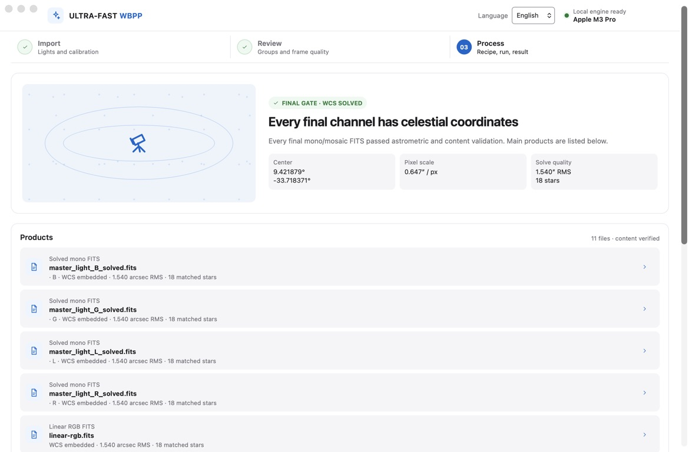

# Ultra-Fast WBPP

**把一晚或多晚的天文拍摄素材，变成完成校准、配准和叠加的图像。**

面向单色天文摄影的本地 Mac 应用：拖入 Light 文件夹和校准帧，检查可疑曝光，然后输出线性 FITS 主图及预览。原始文件保持只读。

[English](../README.md) · [使用指南](recipes/automatic-screening.md) · [验证记录](validation-matrix.md) · [参与贡献](../CONTRIBUTING.md)



*原生 macOS 应用完成处理后的真实截图。[导入界面](../assets/branding/ultra-fast-wbpp-table.jpg) · [筛片界面](../assets/branding/ultra-fast-wbpp-screening.jpg)（合成测试素材）。*

## 主要功能

- **一起导入：**不同日期的 N.I.N.A. 文件夹、FITS／单色 XISF、原始 Flat／Dark／Bias，以及已有校准 Master。
- **先检查再处理：**按元数据分组、匹配校准帧，检查严重虚焦、拖线、过云、遮挡及画面偏离。待复核帧默认排除，明确失败的帧始终排除。
- **本地处理：**生成校准 Master，校准 Light，处理旋转与中天反转的配准，排除异常像素和检测到的瞬态轨迹，叠加并裁切共同覆盖区域。
- **输出结果：**线性单色及 RGB/LRGB FITS、检查预览、筛片依据和处理记录。桌面程序核验最终天球坐标后才显示成功。

## 状态与要求

**仍是积极开发中的 alpha，暂无公开安装包。**当前目标平台为 Apple Silicon、macOS 14+。已在 M3 Pro 上检查过安装包的真实素材流程；其他 Mac 及实际 macOS 14 机器仍待验收。本地构建使用 ad-hoc 签名，尚无 Developer ID 签名和公证。

主要流程面向**单色相机**，暂不支持 OSC／Bayer。Drizzle、LocalNormalization、RGB/LRGB 和马赛克仍需更广泛的真实数据验证。LocalNormalization 不保证消除所有梯度；叠加图可能仍需在后期软件中做背景建模。Windows 有开发／测试目标，暂无受支持的安装包。

最终天文定位需要另行安装 **Astrometry.net 的 `solve-field`** 和本地索引。按[求解器设置](recipes/offline-solver-catalogs.md)配置后，在程序中重新检测。磁盘需留出保存全分辨率中间帧的空间。

## 从源码开始

在 macOS 上准备 Python 3.11+、Rust 1.88+、Node.js 22+、CMake 3.28+，以及包括 Xcode 在内的 [Tauri 开发环境](https://v2.tauri.app/start/prerequisites/)。在仓库根目录执行：

```bash
make bootstrap
make desktop-dev
```

1. **Import／导入：**加入所有 Light 和校准文件夹，检查识别的帧类型、滤镜及校准匹配。
2. **Review／检查：**查看筛片结果，检查可疑帧预览。
3. **Process／处理：**选择新的输出位置，完成后打开 FITS 主图和预览。

界面支持英文和简体中文，不覆盖已有输出目录。缺失元数据和 Master 复用约定见 [N.I.N.A. 输入](recipes/nina-mono.md)及[校准说明](recipes/calibration.md)。

构建自带 Python 运行时的本地 `.app`：

```bash
make desktop-build-macos-prerelease
```

该命令也会下载固定版本的 macOS 运行时构建依赖。签名、DMG 和发布检查见[发布流程](release-process.md)。安装包运行时不要求用户安装 Python、Node.js 或 Rust。

同一引擎也支持命令行：

```bash
.venv/bin/ultra-fast-wbpp run /data/lights /data/calibration --recipe docs/recipes/mono-standard.json --output /data/new-result --progress-json
```

## 开发

| 目录 | 职责 |
|---|---|
| `apps/desktop` | React 界面与 Tauri 桌面桥接 |
| `crates/app-core` | 项目状态与执行协议 |
| `packages/openastroflow-engine` | 校准、处理流水线和命令行 |
| `packages/light-frame-qc` | Light 测量与质量判定 |
| `engine/native` | 配准支持及 C++／Metal 加速 |

`make test` 运行 Python、Rust、前端和原生测试；`make check` 另加 Rust 格式及 lint 检查。`make demo` 启动明确标注的浏览器界面演示，不执行科学处理。另见[架构](architecture.md)和[桌面开发指南](../apps/desktop/README.md)。

性能取决于素材和硬件；支持 CPU／Metal 加速不代表所有阶段都会使用 GPU。[验证记录](validation-matrix.md)说明已测范围和限制。本项目独立实现，**不宣称与 PixInsight/WBPP 算法或像素等价**。

## 许可与来源声明

项目原创代码采用 [MIT 许可证](../LICENSE)。再分发时，包括商用再分发，需保留版权和许可声明。[NOTICE](../NOTICE) 提供建议的来源标注文字。

第三方组件保留各自许可证；Python 运行时不再引入任何 GPL 许可的库（XISF 容器由项目自带的 MIT 读写模块处理）。详见[许可说明](licensing.md)和[第三方声明](../THIRD_PARTY_NOTICES.md)。

本项目不隶属于 PixInsight、Pleiades Astrophoto、N.I.N.A. 或 Astrometry.net，不包含 PixInsight/PCL 源码或二进制。
