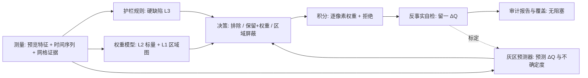

# 无人值守 SOTA 筛片：现状评估与设计

状态：设计与分析稿（2026-09-19），只读分析，未改代码。事实引用以当前工作树为准（`packages/light-frame-qc` 0.3.0 与引擎的 quality gate）。

## 0. 结论先行

1. **现状是一个"缺陷检测器 + 人工复核门"，不是"筛片优化器"**。它用物理动机明确的规则（云、遮挡、拖线、消光、夜间基线）给每帧打 KEEP / REVIEW / REJECT，规则本身保守、负样本测试充分；但它不知道下游管线能修什么、不知道一帧留下或去掉会让 master 变好还是变坏，也没有任何真实数据上的召回/误杀记录。"SOTA"目前既没有定义也没有测量。
2. **无人值守模式下，不确定 = 丢弃**。REVIEW 的默认处置是 EXCLUDED（`e2e.py:4449-4469`），而进入 REVIEW 的条件很多是"证据不足"而不是"帧有问题"：同组少于 8 帧、同夜少于 3 帧、有效像素 < 99.9%、星数 < 20、形态学样本 < 15、配准边缘、共同视场 < 50%。验证记录里那次"19 张 light 只放行了 1 张"（`docs/validation-matrix.md:9`）就是这个机制的必然结果。这与"用户不参与"的目标直接冲突。
3. **筛片与权重是两套互不相通的系统**。QC 的透明度、FWHM、椭率、云分等特征只用于判定和报告；积分权重 = 噪声权重 × 一个 PSF 集中度代理（`native_quality_score`），没有类似 PSF Signal Weight 的量。留下的帧一律"同等合格"，这不是最优叠加。
4. **粒度只有"整帧"和"像素"两级**。16×16 的透明度残差、完备度、背景差、纹理比网格已经算出来了，但只当证据，没有变成区域权重；局部云 < 50% 的帧进 REVIEW 然后被丢掉，而不是保留清晰的 70%。
5. **SOTA 的可操作定义**：在冻结数据集上，自动筛片 + 权重产出的 master，用现有评估器判定不劣于（a）"全部保留 + 最优权重"、（b）用户手工筛片、（c）SubframeSelector 式阈值筛片，且误杀率（丢掉边际贡献为正的帧）接近零。判定每一帧"该不该要"的真值不是人眼，而是**管线自己的反事实实验**：去掉这帧，master 的深度/PSF/背景变好还是变坏。这就是"机器比人更懂筛片"的字面实现，人做不了 61 次反事实叠加。

## 1. 现状事实（关键点）

| 方面 | 现状 | 位置 |
|---|---|---|
| 测量 | 2048 px 预览上 SEP 检星（σ=4.5，≤2500 星），FWHM=2.355·√(ab)，椭率 1−b/a；16×16 背景中值网格与星外纹理 σ 网格；无 HFR 实测（只读 header/文件名） | `measure.py:63-99,129-158,166-201` |
| 分组与参考帧 | 按相机/尺寸/bin/滤镜/gain/offset/视场/曝光分组；参考帧 = 星数最多者（PI psf_signal_weight 仅作平手项），≥8 帧时用两位同伴做连通性校验 | `grouping.py:17-95`；`analysis.py:129-223` |
| 对参考帧的相对量 | 配准（astroalign+RANSAC）、通量比/透明度、逐格透明度残差 p90、星完备度、缺失连通域、边界支持、背景支持、共同视场 | `analysis.py:413-701` |
| 群体共识 | 逐格 10% 分位"晴空包络"，得到 spatial_dimming/brightening；气质量消光包络（Theil–Sen）；夜间基线 | `analysis.py:704-834`；`statistics.py:51-84`；`nightly_statistics.py:193-300` |
| 判定 | 云分/遮挡分/形状分 → REJECT 只在 HIGH 置信且多家族强证据时；否则 ≥2 分即 REVIEW | `analysis.py:927-1143` |
| 门（真正控制放行） | HARD_FAIL：非 light、测量失败、有效像素 < 95%、碎片化拖线、相干拖线、硬遮挡、≥2 家族强云；REVIEW：约 20 条，其中一半是"证据不足" | `quality_gate.py:391-1224` |
| E2E 处置 | 只放行 PASS；REVIEW 默认排除，需 GUI 逐帧 hash 绑定审批；某面板 < 2 帧才阻塞运行 | `e2e.py:4455-4513` |
| 权重 | 噪声权重（归一化后相邻差分 MAD 的逆方差，夹在中值的 1/16–16 倍）× 配准质量权重（Σpeak/Σflux×FWHM²/星数，按滤镜中值归一）；QC 特征不参与 | `calibration.py:2218-2305`；`openastroflow_registration/pipeline.py:324-335` |
| 未做 | 区域权重、时间趋势（对焦漂移、暮光、结露）、导星拖线方向、pier side、banding、PSF Signal Weight 等价量、真实数据的误杀/漏杀统计 | 见 §5 盘点 |
| 可调性 | 引擎/GUI 不暴露任何 QC/门参数（`runtime.py:339-377` 从不设置 `qc_config`/`gate_policy`） | |

现有的优点必须保留：所有规则都有负样本测试（大幅整体变亮不判云、单格塌陷不判遮挡、气质量可解释的变暗不判云、一晴七云不把云学成基线等），门策略有版本与摘要，证据全部落在 `qc/manifest.json`。

## 2. "SOTA 筛片"应该优化什么

筛片是为 master 服务的，所以目标函数必须是 master 的质量，而不是帧的"好看程度"。

- **主目标**：在用户声明的优先级下最大化 master 的可测质量。深度优先 → 目标尺度（如 8 px）上的有效噪声 σ_eff 与空孔径深度；分辨率优先 → 在 FWHM 不劣于最佳帧的 k 倍前提下最大化深度；平衡 → 中间参数。
- **硬约束**：背景平坦度、伪影（拖线残留、光晕）、光度线性、覆盖面积，不得因为筛片而恶化——这些用评估标准里的判定项，不进入综合分。
- **每帧的真值**：边际贡献 ΔQ_i = Q(全部) − Q(去掉 i)（或对高度相关的同夜帧做留组）。ΔQ_i < 0 的帧才该被排除；ΔQ_i ≈ 0 的帧按权重处理；ΔQ_i > 0 的帧被排除就是误杀，这是最贵的错误——数据是用户用整夜换来的。
- **反事实实验的成本**：对固定的归一化与拒绝掩模，加权均值的留一 master 可由累加和解析得到（master₋ᵢ = (S − wᵢxᵢ)/(W − wᵢ)），不需要重新积分；拒绝掩模的二阶变化可忽略。在 4×4 分箱管线上做完整重跑也只要每次几秒。所以"每一帧的真值"在开发期和运行期都算得起。

理论边界（说明为什么"拒绝"应该是最后手段）：对加权均值叠加，点源探测的最优权重 ≈ Tᵢ²/(σᵢ²·FWHMᵢ²)（透明度 T、天光噪声 σ、PSF 宽度），弥散目标的最优权重 ≈ Tᵢ²/σᵢ²。随机噪声主导的"差帧"只要权重正确就仍然增加信息；只有**系统性**缺陷（云的非均匀透明度、归一化修不了的梯度、拖线破坏 PSF 与拒绝统计、遮挡）才值得排除。Zackay & Ofek 的 proper coaddition 用各帧自己的 PSF 做匹配滤波，理论上连软帧都不需要排除，这是叠加算法层面的上限，可作为后续算法选项（在单源内核框架下只写一次）。

## 3. 粒度阶梯（回答"粒度怎么把握"）

原则：**在能把缺陷与信号分开的最细粒度上处理它；只有当缺陷是全局的且下游无法建模时才排除整帧**。每一级都要有"下游能修多少"的量化依据，而不是绝对阈值。

| 级别 | 处理对象 | 手段 | 现状 |
|---|---|---|---|
| L0 像素 | 宇宙线、卫星/飞机拖线、热像素 | MAD 拒绝 + 瞬态走廊 | 已有（`transient_rejection.py`），帧保留 |
| L1 区域（新增） | 局部云、树/圆顶/墙遮挡、局部反光、部分结露、边缘晕影不匹配 | 每帧空间权重图（16×16 网格平滑到像素），权重 ∈ [0,1]，由透明度残差、完备度、背景差、纹理比推出；积分内核支持逐像素权重 | 网格证据已有，未被消费 |
| L2 帧标量权重 | 薄云/雾/气质量造成的均匀透明度下降、月光/天光噪声、视宁/对焦、轻微拖长 | 权重公式 w = T²/σ² × PSF 项（指数随优先级 0…2）× 置信度；权重低于中值 2% 才为效率丢弃 | 噪声权重已有；QC 特征未接入 |
| L3 整帧排除 | 配准失败、透明度 < 归一化下限（`minimum_scale=0.50`）、相干强拖线、遮挡 > 30%、测量失败、非 light、反事实证明 ΔQ < 0 且置信高 | 硬规则 + 反事实 | 硬规则已有；反事实无 |
| L4 夜/组 | 整夜失焦、整夜零点漂移、pier side、曝光组 | 夜间权重因子与分组，不排除 | 部分（夜间基线只用于判定） |

三条落地规则：

1. **不确定不等于排除**。所有"证据不足"类 REVIEW（小队列、无夜间基线、星少、形态学样本少、有效像素 99.9%–95%、共同视场偏小）在无人值守下一律按 L2 处理：保留，权重乘以置信度，写入审计报告。只有硬缺陷才走 L3。
2. **阈值要对着下游标定**。归一化能吸收的乘性范围（0.5–2.0）、加性网格幅度上限（reference sky 的 25%）、拒绝统计需要的最少帧数，这些是管线已知的能力；筛片阈值应由它们和反事实实验推导，而不是手写的 0.35 mag / 0.18 mag。
3. **决策边界用真值标定**。L2 与 L3 的分界、每个权重项的指数，用冻结数据集上的 ΔQ_i 做 ROC/校准；规则保留为物理护栏（负样本测试继续有效），学习模型只负责灰区。

## 4. 设计

### 4.1 架构

### 4.2 组件

1. **`selection/oracle.py`（开发期 + 运行期自检）**：对一次运行的归一化帧与权重，输出每帧 ΔQ（深度、FWHM、背景三项分别报告，加上用户优先级下的标量），4×4 分箱或解析留一两种模式；结果写入 receipt 的 `qualityControl.counterfactual`。这是唯一能回答"筛片是否 SOTA"的工具，也是后面所有标定的数据源。
2. **护栏规则（沿用）**：现有 HARD_FAIL 集合去掉"证据不足"类，加上"透明度低于归一化下限"。保持负样本测试。
3. **权重模型**：统一到一处（现在分散在 `calibration.py` 与 `openastroflow_registration/quality.py`）：`w_i = (T_i²/σ_i²) · FWHM_i^(−2p) · c_i · n_i`，T 来自已有的恒星尺度提示，σ 来自归一化后的噪声估计，p 由优先级决定（深度 0、平衡 1、分辨率 2），c 为置信度，n 为夜间因子。用 ΔQ 校验这个公式确实优于当前的"噪声 × PSF 代理"。
4. **区域权重图**：从 `analysis.py:675-700` 的网格（透明度残差、完备度、背景差 z、纹理比）生成每帧 16×16 权重，Gaussian 平滑后双线性上采样；积分的加权均值内核增加逐像素权重输入（单源内核框架下一处改动）；拒绝统计不变。云边界处的权重过渡宽度按平滑尺度决定。
5. **灰区预测器**：输入约 15 个每帧特征（透明度、逐格残差 p90、完备度、FWHM 与其相对夜间基线、椭率与相干性、背景 z、噪声比、共同视场、时间趋势斜率），输出 ΔQ 的预测与区间。数据少时用带单调约束的小模型（保序回归或单调 GBM），每个数据集的 ΔQ 由 oracle 产生；不上深度学习。
6. **时间序列特征（新增测量）**：同夜按时间排序的 FWHM/HFR/背景/透明度斜率（对焦漂移、暮光、薄云进入）；PSF 翼部比例 F(2·FWHM)/F(10) 的趋势（结露）；拖长角度（导星轴）；pier side（header 或配准旋转类）；行列投影残差（banding）。
7. **无人值守策略与审计**：默认全自动；每次运行输出 `qc/selection-report.html`：被排除帧的缩略图、原因、反事实数字（"排除这 3 帧使 8 px 深度提高 0.02 mag"），区域屏蔽图，权重分布；GUI 的 Review 变为可选检视，不再是门。覆盖只保留两种：用户强制包含某帧、用户强制排除某帧，仍 hash 绑定。

### 4.3 与用户的接口

只暴露两个选项：优先级（深度 / 平衡 / 分辨率）与"激进程度"先验（保守 / 标准 / 激进，只影响灰区的决策阈值）。其余全部自动，并且每个决策可事后审计。

## 5. 如何证明"SOTA"

- **数据集**：NGC 7331 四晚 61 帧（含翻转夜）、38 帧 B 通道 fixture、验证矩阵里那套 370 帧计划审计集、那次只放行 1 帧的 19 帧集（作为误杀回归案例），再补 3–5 套含已知问题的数据（薄云、局部云、整夜失焦、结露、强月光）。按拍摄夜划分开发/测试。
- **基线**：(a) 全部保留 + 当前权重；(b) 全部保留 + 新权重；(c) 当前 QC（REVIEW 排除）；(d) 新方案；(e) 用户手工筛片；(f) SubframeSelector 式阈值（FWHM/椭率/星数分位）。
- **指标**：master 层用评估标准的判定项（σ_eff、深度、FWHM、背景、伪影、覆盖）；帧层用 ΔQ 符号的混淆矩阵——误杀率（排除了 ΔQ > 0 的帧）目标 < 2%，漏杀率（保留了 ΔQ < −τ 的帧）目标 < 5%；无人值守率 = 100%（构造上保证）。
- **通过标准**：(d) 对 (a)(c)(e)(f) 在所有数据集上不劣，且在至少一半数据集上更好；任何一个数据集上出现误杀率 > 5% 即不发布。

## 6. 分期

| 阶段 | 内容 | 产出 | 估算 |
|---|---|---|---|
| P0 测真值 | 反事实 oracle（4×4 分箱重跑 + 解析留一）；在 NGC 7331 与 B fixture 上跑当前 QC 的混淆矩阵 | 第一份"现状是否达标"的数字 | 1 周 |
| P1 止损 | 无人值守策略：证据不足类 REVIEW 改为保留+降权；审计报告；保留硬缺陷排除 | 消除"只放行 1 帧"类失败 | 3–5 天 |
| P2 权重 | 统一权重公式并接入 QC 特征与夜间因子；用 ΔQ 验证优于现权重 | 全保留基线 (b) | 1 周 |
| P3 区域权重 | 网格 → 权重图 → 逐像素加权内核（单源） | 局部云/遮挡帧部分利用 | 2 周 |
| P4 标定与学习 | 时间序列特征；阈值 ROC 标定；灰区预测器；发布基准协议与结果 | 可宣称的 SOTA 证据 | 2–3 周 + 数据收集 |
| P5 可选 | proper coaddition 作为叠加算法选项 | 软帧无需排除 | 后续 |

P0 应该最先做，也最便宜；它决定后面每一步的方向，也是唯一能诚实回答"现在做到了没有"的办法。

## 7. 需要用户提供的

- 你自己对 NGC 7331 四晚帧的手工取舍（哪些你会扔），作为基线 (e)。
- 那次"19 张只放行 1 张"的数据是否还在；它是最有价值的误杀案例。
- 历史数据里有明确问题（薄云、结露、失焦夜、局部遮挡）的 session，用于补齐数据集。

## 8. 不依赖用户标注的实现路径（薄云、结露、失焦夜、局部遮挡，且不过度）

前提：每一帧"该不该要"的真值由反事实实验给出，每种缺陷"是不是"由物理签名 + 队列/夜间/气质量基线给出，两者都不需要人工标签。开发期用**在真实帧上注入合成缺陷**得到带标签的数据（薄云 = 乘以透明度并加散射天光；结露 = 随时间增大的核卷积 + 翼部光晕；失焦 = 卷积/环状核；遮挡 = 带背景异常的硬边区域），同时注入良性对照（气质量消光、真实星云、指向偏移、整体变亮变暗），要求检测器对前者有召回、对后者不误报。

| 缺陷 | 物理签名（可从预览得到） | 易混淆的良性情况与区分 | 处理 | 排除条件 |
|---|---|---|---|---|
| 薄云 | 透明度 T 低于气质量消光包络；背景与噪声上升；星数下降；逐格残差中等 | 气质量消光（包络拟合）；整夜雾霾（夜间基线）；滤镜/曝光差异（分组） | 权重 T²/σ² 自动降权；透明度非均匀时区域权重 | T < 归一化下限 0.5，或额外消光 > 0.75 mag，或归一化加性网格被拒绝且反事实证明背景变差 |
| 结露 | 同夜按时间单调恶化：FWHM/HFR 上升、翼部比例 F(2·FWHM)/F(10) 上升、峰值/通量下降、透明度下降、不恢复 | 视宁（随机起伏、不单调）；对焦漂移（核变宽但翼部不长）；薄云（T 降但 FWHM 稳） | PSF 项降权（指数随优先级） | FWHM > k × 夜内最佳（分辨率优先 k=1.3，平衡 1.6，深度 2.0），或反事实显示 master FWHM/深度恶化 |
| 失焦夜 | 整夜 FWHM 相对最佳夜 ≥ 1.15；核集中度 C=F1.5/F10 比 FWHM² 预期下降更快（环状/平顶） | 夜间视宁差异（对 master 而言处理相同，不需要区分原因） | 夜间 PSF 因子 | 同上，按优先级；深度优先时整夜保留降权，分辨率优先时排除 |
| 局部遮挡 | 连通缺失区域 + 硬边界 + 区域内背景/纹理异常；在传感器坐标下位置随时间连续（圆顶/树随高度变化） | 暗星云（所有帧共有 → 共识包络消除）；指向偏移（视场重叠）；晕影（所有帧共有） | 区域权重 = 0（含平滑尺度的边缘余量），其余保留 | 遮挡面积 > 50%，或剩余区域的反事实贡献 ≤ 0 |
| 导星/风拖线 | 椭率与方向相干性高于夜间基线 | 光学像散（所有帧共有、方向随位置变化） | 轻微时降权 | 中值椭率 ≥ 0.45 且相干 ≥ 0.75（现有硬规则），或反事实显示拒绝统计/PSF 恶化 |
| 暮光/月光 | 背景与噪声升高、随时间单调（暮光）| 光害稳定夜（基线） | 噪声权重 | 饱和/非线性，或噪声权重 < 中值 2% |
| banding/传感器 | 行列投影残差周期性 | 无 | 无法用区域修复 → 帧级 | 幅度 > 天光噪声的 k 倍（自检标定） |

**不过度的结构性保障**

1. 非对称默认：不确定 → 保留 + 降权。错留一帧的代价被权重限制，错删一帧的代价是整帧信息。
2. 排除必须自证：除硬缺陷外，每个排除决定在运行期用解析留一验证 ΔQ < −τ 且置信区间不含 0；整夜排除用留组验证。
3. 阈值相对队列/夜/气质量而非绝对值；小队列没有基线时不做云判定，只做权重。
4. 排除比例护栏：软原因排除超过 30% 帧时，改为组级反事实决定。
5. 优先级只由用户的一个选项决定（深度/平衡/分辨率），它决定的是 PSF 项的指数与 FWHM 截止，不是"删不删薄云"。

**残余风险**：只有用户手头几套数据时，罕见条件（极光、极强光害、窄带稀疏星场）的标定可能偏差；上述保障使偏差方向是"多留少删、低权重"，不会出现整夜被静默丢弃的失败。用户标注能加速标定，但不是前提。
